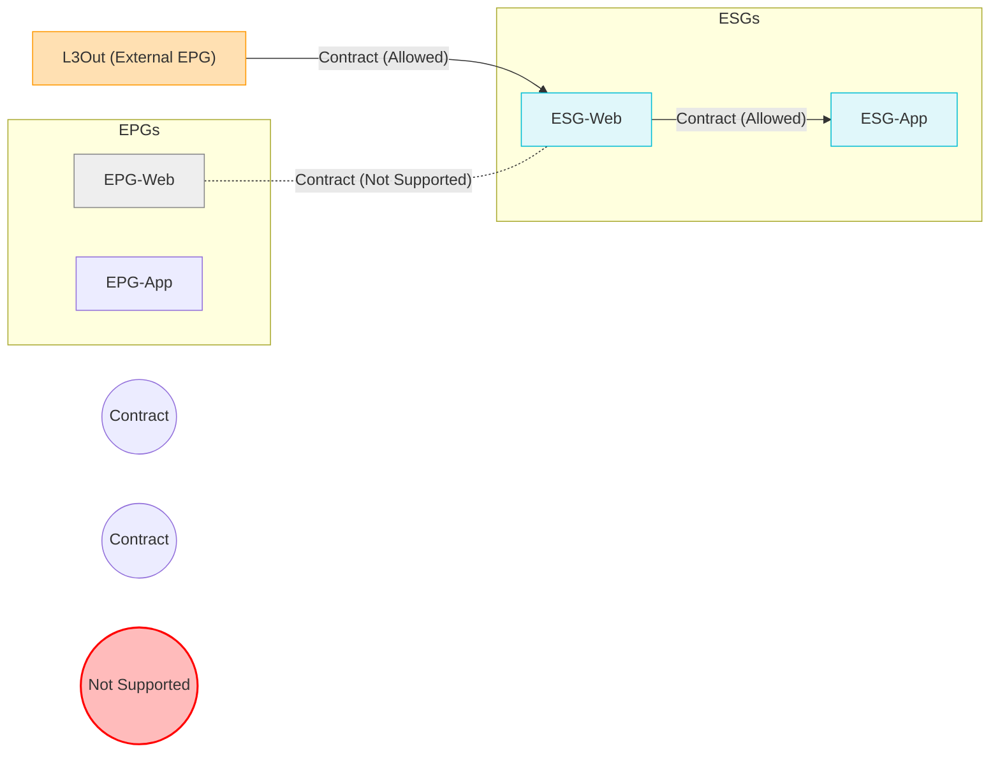

# ESG Contract Relationships: Visual Diagram

```mermaid
flowchart LR
    subgraph ESGs
        ESG1["ESG-Web"]
        ESG2["ESG-App"]
    end
    subgraph EPGs
        EPG1["EPG-Web"]
        EPG2["EPG-App"]
    end
    L3Out["L3Out (External EPG)"]
    Contract1(("Contract"))
    Contract2(("Contract"))
    ContractX(("Not Supported"))

    ESG1 -- "Contract (Allowed)" --> ESG2
    L3Out -- "Contract (Allowed)" --> ESG1
    EPG1 -. "Contract (Not Supported)" .- ESG1

    style ContractX fill:#fbb,stroke:#f00,stroke-width:2px
    style EPG1 fill:#eee,stroke:#888
    style ESG1 fill:#e0f7fa,stroke:#00bcd4
    style ESG2 fill:#e0f7fa,stroke:#00bcd4
    style L3Out fill:#ffe0b2,stroke:#ff9800
```

**Legend:**
- **Solid arrows:** Supported contract relationships
- **Dashed arrow:** Not supported (EPG-to-ESG contract) 